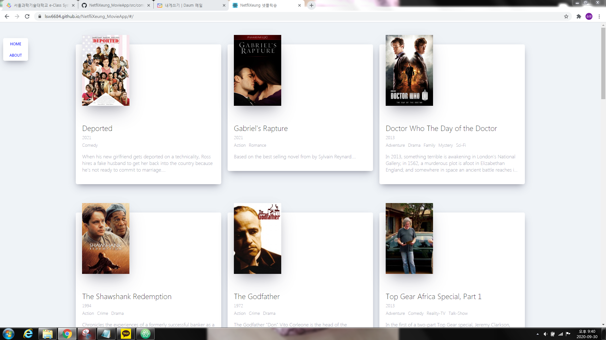

# Movie App

## React JS Fundamentals course (2020 update!)

### This is including API about Movie Information

I practiced ***component, JSX, DOM, JSON, Router, Navigator and so on using React.js ***

#### This will be more interactive

# [You can try this](https://lsw6684.github.io/NetfliXeung_MovieApp/)

